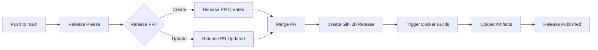

# Release Process Documentation

## Overview

Screen2Action uses [release-please](https://github.com/googleapis/release-please) for automated version management and release creation. This ensures consistent versioning, automatic changelog generation, and streamlined release workflows.

## How It Works

### 1. Conventional Commits

The release process is driven by [Conventional Commits](https://www.conventionalcommits.org/). Use these commit prefixes:

- `feat:` - New features (bumps minor version)
- `fix:` - Bug fixes (bumps patch version)
- `perf:` - Performance improvements
- `docs:` - Documentation changes
- `chore:` - Maintenance tasks
- `build:` - Build system changes
- `ci:` - CI/CD changes
- `refactor:` - Code refactoring
- `test:` - Test additions or changes
- `style:` - Code style changes

**Breaking Changes**: Add `BREAKING CHANGE:` in the commit body or `!` after the type (e.g., `feat!:`) to trigger a major version bump.

### 2. Automated Release Flow



### 3. Release Workflows

We have three release-related workflows:

1. **`release-please.yml`** - Manages version bumps and changelogs
2. **`release-docker.yml`** - Builds releases with Docker (can be triggered manually)
3. **`release-integrated.yml`** - Complete automated release pipeline

## Usage

### For Contributors

1. **Write meaningful commit messages**:
   ```bash
   git commit -m "feat: add dark mode support"
   git commit -m "fix: resolve memory leak in audio recording"
   git commit -m "feat!: redesign API (BREAKING CHANGE: removed v1 endpoints)"
   ```

2. **Push to main** (via PR):
   ```bash
   git push origin feature-branch
   # Create PR and merge to main
   ```

### For Maintainers

1. **Release Please creates a PR automatically** when commits are pushed to main
   - PR title: "chore: release 1.2.0"
   - Contains version bumps and CHANGELOG updates

2. **Review the Release PR**:
   - Check the changelog is accurate
   - Verify version bump is appropriate
   - Add any manual notes if needed

3. **Merge the Release PR** to trigger:
   - GitHub Release creation
   - Docker builds for all platforms
   - Artifact uploads to the release

4. **The release is automatically published** with:
   - Platform-specific installers (.dmg, .exe, .AppImage)
   - Updated changelog
   - Installation instructions

## Manual Release (if needed)

If you need to create a release manually:

```bash
# Option 1: Trigger via workflow dispatch
# Go to Actions > "Build and Release (Docker)" > Run workflow

# Option 2: Create tag manually
git tag v1.2.3
git push origin v1.2.3
```

## Version Management

### Version Files

Release-please automatically updates versions in:
- `package.json` - Node.js package version
- `backend/pyproject.toml` - Python package version
- `CHANGELOG.md` - Version history
- `.release-please-manifest.json` - Current version tracking

### Version Strategy

- **Major (1.0.0)**: Breaking changes
- **Minor (0.1.0)**: New features
- **Patch (0.0.1)**: Bug fixes and small changes

### Pre-releases

For alpha/beta releases, manually create tags:
```bash
git tag v2.0.0-beta.1
git push origin v2.0.0-beta.1
```

## Configuration

### Release Please Configuration

Edit `release-please-config.json` to customize:
- Changelog sections
- Commit message format
- PR title format
- Version bumping rules

### Workflow Configuration

Edit `.github/workflows/release-integrated.yml` to modify:
- Build platforms
- Docker image settings
- Asset upload behavior

## Troubleshooting

### Release PR Not Created

**Issue**: No PR appears after pushing to main

**Solutions**:
- Ensure commits follow conventional commit format
- Check Actions tab for workflow errors
- Verify `release-please.yml` is on main branch

### Build Failures

**Issue**: Docker builds fail during release

**Solutions**:
- Check Docker base image is up to date
- Verify dependencies in `package.json` and `pyproject.toml`
- Review build logs in Actions tab

### Missing Artifacts

**Issue**: Release created but artifacts missing

**Solutions**:
- Check `release-integrated.yml` upload steps
- Verify build outputs in correct directories
- Ensure GitHub token has correct permissions

## Best Practices

1. **Commit Hygiene**:
   - One feature/fix per commit
   - Clear, descriptive commit messages
   - Use conventional commit format

2. **Release Frequency**:
   - Regular releases (weekly/bi-weekly)
   - Bundle related changes together
   - Don't let PRs accumulate

3. **Testing**:
   - Test builds locally before release
   - Verify artifacts work on target platforms
   - Check changelog accuracy

4. **Communication**:
   - Announce major releases
   - Document breaking changes clearly
   - Update README for new features

## Example Release Cycle

1. **Development Phase**:
   ```bash
   git commit -m "feat: add CSV export functionality"
   git commit -m "fix: correct timezone handling"
   git commit -m "docs: update API documentation"
   ```

2. **Release Please Creates PR**:
   - Title: "chore: release 1.3.0"
   - Bumps version from 1.2.0 to 1.3.0
   - Updates CHANGELOG with all commits

3. **Merge PR**:
   - Creates GitHub Release v1.3.0
   - Triggers Docker builds
   - Uploads installers

4. **Release Published**:
   - Users can download from Releases page
   - Changelog shows what's new
   - Version 1.3.0 is live!

## Links

- [Release Please Documentation](https://github.com/googleapis/release-please)
- [Conventional Commits](https://www.conventionalcommits.org/)
- [Semantic Versioning](https://semver.org/)
- [GitHub Releases](https://docs.github.com/en/repositories/releasing-projects-on-github)